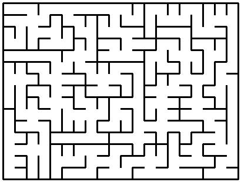

# Grupo-A1_7
Repository destinated to develop the Laboratory Practises for the subject "Intelligent Systems" in Escuela Superior de Informática - Ciudad Real

# Development decisions

The Project has been developed using Python3, due to easiness with the image generation (using the **PILLOW module**) and json files manipulation (using the **JSON library** that is included in Python3).

## [1] Functional requirements identified
-	**Execute the Wilson’s Algorithm** for generating a Maze where all the cells are connected, in other words, there are not isolated places in the maze.
-	**Generate a JPEG image** of the generated maze. 
-	**Generate a JSON file** with a concrete format that represents the maze.
-	**Read JSON files** to generate an image of the maze.
-	**Notify** in case an **“Inconsistency”** is found in the introduced JSON file.

## [2] Structure decisions
### First functional requirement 
We decided to have both classes **Cell.py** and **Maze.py** as we want to save some information about every cell (its position in the maze and some state information) and the information relative to the Maze (number of rows and columns and its body).

For each cell we have an **ID** which is a tuple with its corresponding placement coordinates  <x, y>, a list of Boolean values for the walls (**N**orth, **E**ast, **S**outh and **W**est), and two more Boolean attributes, **Visited** and **Final**.

For every Maze we have to save information about the number of **Rows** and the number of **Columns** and finally as we have to store the cells in a data structure that represents a maze we have chosen  a List of Lists that works as an “Array”. The Maze **Body**.

### Second functional requirement
For this functional requirement we have decided to include it as a method of the class **Maze.py** that will be explained later.

### Third functional requirement
For this functional requirement we have decided to include it as a method of the class **Maze.py** that will be explained later.

### Fourth functional requirement
To accomplish this functional requirement, we have decided to implement the **JSONReader.py** class which has the path of the chosen file as attribute as well as the file object and the JSON objects used to safe the information stored in the JSON file into the memory of the program using a Maze object.

### Fifth functional requirement
In order to complete this functional requirement, the **InconsiSpector.py** class is created, this class only have methods to fulfill its purpose, methods that will be explained later. This class works as an **Inspector** that looks for inconsistencies in a suspicious maze.

## [3] Algorithm development
The algorithm itself uses two lists that works as stacks (**LIFO**), the first one is a **Frontier** and the second one is a **Directions** List. These lists are attributes of the **Maze.py** class as the algorithm execution takes place in this class.

We can clearly identify two main parts in the Wilson’s algorithm execution, a first one of “Building the main path” and a second one of “Completing the maze”

For the algorithm we recognize three states during the main path building:

-	Choosing two random cells (that cannot be the same) one will be the goal cell (marking it as final) and the other will be the beginning cell (adding it to the frontier as visited cell) 
-	Following the Wilson’s algorithm rules, we go cell by cell choosing a random next hop. On that way we keep storing the **“decisions”** taken by the cells by adding the chosen direction to the **Directions** list until we find the goal cell. We also save the identifier of the visited cells in the **Frontier** list.
-	Once we have found the goal cell when we can “dig” the path by turning to True the corresponding values of the NESO list of every cell chosen and marking the cells as final.

In this way the Frontier list contains the visited cells and the Directions one contains the decision taken by the cells.

Example of the first two iterations:
IT1:  <Frontier> [(0, 0)]		<Directions> []
IT2:  <Frontier> [(0, 0), (0, 1)]		<Directions> [“E”]

Once this first part of the algorithm is finished we start the second one, that has the same behavior but instead of choosing a goal cell this time it only chooses the beginning cell and then it keeps choosing neighbor cells randomly until it reaches one of the cells that is part of the final maze (we know this by looking at the final value of the cell) where it digs again and that path becomes part of the final maze.

In both parts we keep track of the selected cells due to avoid loops, and in case that a loop is going to be formed we remove our steps until we reach the cell where the loops begins.

## [4] Image generation
We generate maze pictures by first creating a blank image with the needed size in which, later, we draw each cell corresponding walls with lines. For each cell we consider a size of **20x20 px.**, and a margin of **5 px** in every border. The width for the walls was selected to be of **3 px.**

## [5] JSON file generation
For the JSON file generation we use an element called **“Dictionary”** that allow us to dump the information about the maze into a JSON file by using the corresponding libraries and applying the correspondent format.

 
# Code explanations
## Cell.py
In this class we defined only one method:
-	**get_random_neighbour(rows: int, columns: int) : tuple**

This method task is to select randomly a neighbor to hop in the next iteration, it takes in count that a border cell (cell that is positioned in the border limits of the maze) cannot choose a neighbor that does not exist.

This method works using indexes to select a neighbor, first it chooses a direction [Norte, Sur, Este, Oeste] and then, if it’s possible, it returns the indexes that reference the position in the maze of the next hop cell. (These indexes are the same as the **ID** of a cell).

## Maze.py
This class is composed of several methods but eh most relevant ones are:
-	**generate_wilson(): Void
-	**generate_image(): Void
-	**generate_json(): Void
-	**get_initial_random_cells(): Void
-	**get_random_cell(): Void
-	**find_path(kind: String): Boolean
-	**dig(): Void

**generate_wilson()** method only invokes the necessary methods to complete its task.

**generate_image()** method firstly creates an image, a white background one of a concrete size which depends on the number of rows and columns that has the **body** of the Maze. (The size in px depends on the size of a cell in px which is 20x20).
Then in order to draw the maze it uses a **pointer** which stores coordinates, to be concrete¸ those coordinates are the top-left corner of a cell and then this method goes cell by cell painting the necessary walls depending on the position of the **pointer**. During the process, the **pointer** is updated as we want this method to work correctly. For this representation, the method uses the **PILLOW** module that allow us to create the image and paint on it.

**generate_json()** method uses the **dictionary** data type to stablish the correct format of the JSON file and then, going through the **body** of the maze it updates the dictionary and finally, using the **json** library dumps the dictionary into a JSON file.

**get_initial_random_cells()** method randomly selects two cells then it sets to **True**  the final value of one of the selected cell and that is the **goal cell** then it marks as visited the other cell (which is the **beginning cell**) and finally it adds the cell’s id to the **Frontier**.

**get_random_cell()** method selects randomly a cell (which will be the new **beginning cell**) and checks if it is part of the final maze, if it is not then it sets that cell as visited and then it adds the cell’s id to the **Frontier**.

**find_path()** method firstly selects the last element introduced in the **Frontier** and makes that cell to randomly choose one of its neighbors. Then if the selected cell was not included in the **Frontier** previously, in other words, if it was not visited before it is marked as visited, update its **NESO**  and is added to the **Frontier**. At the same time, the direction chosen by the first cell is also saved in the **Directions** list to dig later.

But if the selected cell was already visited then we keep removing cells of the **Frontier** until we reach the cell were the loop begins, unvisiting the cells and updating its corresponding **NESO values.

This method has also a double purpose, for that if its destinated to create the main path the “Main_path” keyword must be included as parameter otherwise the “Path” keyword must be used because this is our “win condition”. 

If we are in the first case, we must stop the loop when we find the **goal cell** (at this moment is the only cell that has its **final** attribute set to **True**) and dig. On the other hand, if we are in the second case then we have to stop when we find any **final** cell (any cell that is part of the final maze) returning **True** in both cases.

**dig()** method goes through the **Frontier** list and repeats the same for every cell that is into the frontier going backwards until it gets to the beginning cell. 
It sets the **final** attribute to **True** (which means that that cell is now part of the final maze) then it sets to **True** the corresponding component of the **NESO** list of the cell in order to avoid inconsistencies. 

## JSONReader.py
This class is composed of four main methods and some auxiliary ones, but in this document, we are going to explain only the first four as the last ones are  easy to understand as they are very simple method.

Those methods are:
-	**ask_for_file(): String
-	**read_json(): Void
-	**generate_temp_maze(): Maze.Maze
-	**generate_image(): Void

**ask_for_file()** method uses the **tkinter** library to launch the File Manager of the OS, this helps the user to choose in an easy way the file that wants to load in the program.

**read_json()** method, first checks if the introduced file is a valid one, in other words, if it is a JSON file. Otherwise the program notifies the error and does not try to draw any maze. But if it is a valid one then it opens and loads the JSON file.

**generate_temp_maze()** method uses the **json** library in order to access the information stored in the JSON file by using Keys.  And copying that information in the **body** of a temporal maze used to draw.

**generate_image()** method has the last protection barrier which is to invoke the **InconsiSpector.py** class and make sure that the JSON file is free of inconsistencies before it is being drawn. If it is then the **generate_image()** method of the **Maze.py** class is launched.

## InconsiSpector.py
This class has one principal method and three auxiliar ones that complete the functionality of the first one. These methods are:
-	**find_inconsistencies(suspicious_maze: Maze) : boolean
-	**border_inconsistency(suspicious_maze: Maze): boolean
-	**isolated_cell(suspicious_maze: Maze): boolean
-	**bad_neighbors(suspicious_maze: Maze): boolean

**find_inconsistencies()** method has a combination of conditional clauses in order to notify an inconsistency as soon as one of them is found. The order of execution is determined by its complexity of execution trying to avoid long execution times when a JSON file is introduced. If a **“light-inconsistency”** is found, then it is no necessary to check the others as the file is already not valid.

**border_inconsistency()** method looks for blank spaces in the border of the maze, in other words, if there is a True value in the border cells **NESO** list (“**N**” for the top row, “**E**” for the right-most column, “**S**” for the bottom row and “**O**” for the left-most column). In order to accomplish this task, it goes through the first and the last row of the **body** list of the maze. If there is no problem, then it goes through the first and last column of the **body** list of the maze. 

**isolated_cell()** method looks for a cell that has every component of its **NESO list** set as **False** which means that this cell is unreachable. For that it goes through the entire **body** of the maze.

**bad_neighbors()** method looks for a “misunderstanding” between two neighbor cells, this happens when a cell has, for example, its “N” as True and the top neighbor has not it’s “S” as True as well.
For that reason, the method goes through the list checking only the Left and Bottom neighbors of every cell in order to avoid the maximum repetition of checks as possible. Obviously bounds problems are avoided.

# Example of the Result

